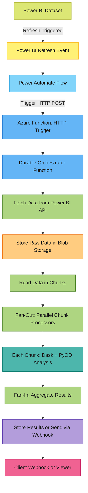

## Power BI Data Change Triggered  Analysis Pipeline (Azure)

## Objective

Automatically detect and process **Power BI dataset changes**, and run **scalable Python-based analysis** (e.g., outlier detection, etc.) using **Azure Durable Functions**. Final results are saved or delivered to a client endpoint.

---

## High-Level Architecture Overview

---

## Tech Stack Overview

| Layer | Component | Technology |
| --- | --- | --- |
| **Source** | Dataset | Power BI |
| **Trigger Automation** | Refresh Event | Power Automate |
| **Pipeline Entry** | HTTP Trigger | Azure Function (Python) |
| **Workflow Engine** | Durable Orchestration | Azure Durable Functions |
| **Storage** | Intermediate & Final | Azure Blob Storage |
| **Processing** | Scalable Analysis | Dask + PyOD |
| **ML Model** | Outlier Detection | IsolationForest, LOF (via PyOD) |
| **Fan-out/Fan-in** | Parallelism | Durable Fan-out Activities |
| **Client Output** | Results Delivery | Webhook or Blob Explorer |

---

## Execution Flow

1. Power BI dataset gets refreshed (scheduled or manually).
2. Power Automate listens for the dataset refresh completion.
3. Power Automate triggers Azure Function via HTTP.
4. Durable Orchestrator begins:
    - Fetches data from Power BI REST API
    - Stores raw data in Azure Blob Storage
    - Reads data in chunks
    - Processes each chunk with `Dask + PyOD`
    - Aggregates and stores/sends results

---

## Why this?

- **Scalable** for millions of rows via Dask chunking
- **Event-driven** via Power BI + Power Automate
- **Durable & Serverless**: no infrastructure maintenance
- **Flexible** to add more models/steps later

---